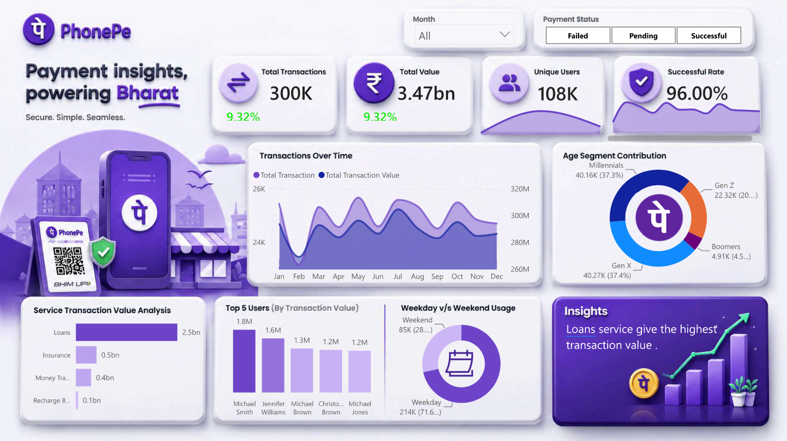

<div align="center">

# 📊 PhonePe Business Analytics Dashboard

### 🚀 Interactive Power BI Dashboard for Digital Payment Analytics



<br>


</div>

---

# 📌 Project Overview

The **PhonePe Business Analytics Dashboard** is an interactive Business Intelligence solution developed using **Microsoft Power BI**. It provides a comprehensive view of digital payment transactions, enabling businesses to monitor performance, analyze user behavior, identify trends, and make data-driven decisions through interactive dashboards and KPIs.

---

# ✨ Features

- 📈 Transaction Trend Analysis
- 💰 Total Transaction Amount
- 💳 Total Transactions
- 👥 Total Users
- ✅ Payment Success Rate
- 📊 Interactive KPI Cards
- 📅 Monthly & Yearly Analysis
- 📍 Category-wise Analysis
- 👨‍👩‍👧 Age Group Analysis
- 🎯 Interactive Filters & Slicers
- 📉 Business Insights
- ⚡ Dynamic Visualizations

---

# 🛠 Tech Stack

| Technology | Purpose |
|------------|---------|
| Microsoft Power BI | Dashboard Development |
| Power Query | Data Cleaning & Transformation |
| DAX | Measures & Calculated Columns |
| Microsoft Excel | Dataset |
| Data Modeling | Relationship Management |

---

# 📂 Dataset

The dataset used in this project is available in this repository.

| File | Description |
|------|-------------|
| **PhonePe_Business_Analytics_Dataset.xlsx** | Raw transaction dataset used to build the dashboard |

---

# 📊 Dashboard KPIs

- 💰 Total Transaction Amount
- 💳 Total Transactions
- 👥 Total Users
- 📈 Monthly Growth
- ✅ Payment Success Rate
- 📍 Category-wise Performance
- 📊 Age Segment Contribution
- 🏆 Top Performing Categories

---

# 📈 Key Insights

- ✔️ Digital payment success rate remained consistently high.
- ✔️ Monthly transaction volume showed steady growth.
- ✔️ Younger users contributed significantly to transaction activity.
- ✔️ Category-wise analysis identified major revenue contributors.
- ✔️ KPI cards provide a quick overview of overall business performance.

---

# 🚀 How to Use

1. Clone or download this repository.
2. Open **PhonePe_Business_Analytics_Dashboard.pbix** using **Microsoft Power BI Desktop**.
3. Refresh the dataset if required.
4. Explore the dashboard using interactive filters and slicers.

---

# 📁 Repository Structure

```text
phonepe-business-analytics-dashboard
│
├── README.md
├── dashboard.png
├── PhonePe_Business_Analytics_Dashboard.pbix
├── PhonePe_Business_Analytics_Dashboard.pdf
├── PhonePe_Business_Analytics_Dataset.xlsx
└── LICENSE
```

---

# 💡 Skills Demonstrated

- Power BI Dashboard Development
- Data Cleaning & Transformation
- Data Modeling
- DAX Calculations
- KPI Dashboard Design
- Business Intelligence
- Data Visualization
- Dashboard Storytelling
- Business Analytics

---

# 🎯 Business Objective

The objective of this dashboard is to analyze digital payment transactions, monitor key business metrics, identify customer behavior patterns, and support data-driven decision-making through interactive visualizations.

---

# 👨‍💻 Author

## Rohan Doble

🎓 B.Tech – Computer Science Engineering

💼 Aspiring Data Analyst | Power BI Developer | Python | SQL

### Connect with Me

- **GitHub:** https://github.com/rohandoble-15
- **LinkedIn:** https://www.linkedin.com/in/rohan-doble-b5a702237?

---

# ⭐ Support

If you found this project useful, consider giving it a **⭐ Star** on GitHub.

---

# 📜 License

This project is created for **learning, portfolio, and demonstration purposes**.

---

<div align="center">

## ❤️ Thank you for visiting this repository!

### Built with Microsoft Power BI

</div>
